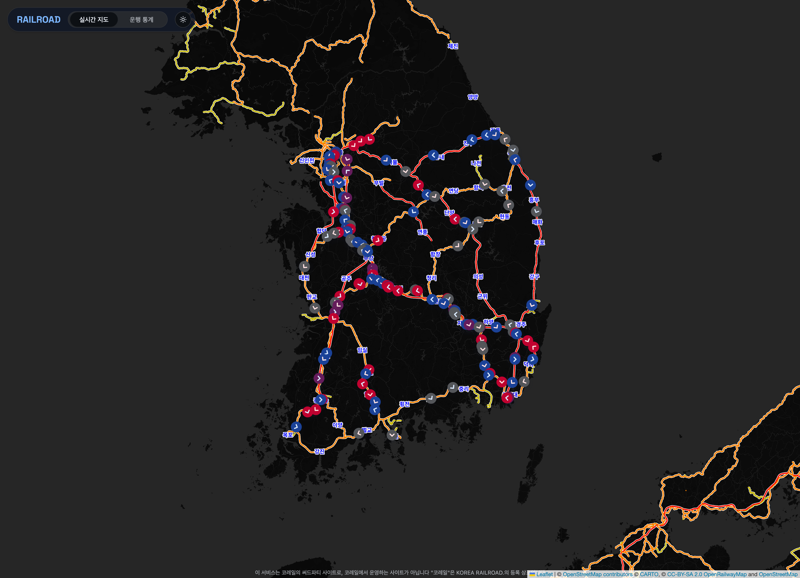

# RAILROAD

> https://train.lth.so

`RAILROAD`는 실시간 코레일 열차 대시보드입니다. 실시간 열차 지도, 열차 스케줄 조회, 역/구간/지연 통계를 한 서비스 안에서 함께 제공합니다.



## 주요 기능

- 인터랙티브 철도 지도 위에 실시간 열차 위치 표시
- URL과 연동되는 열차 선택 및 특정 열차 따라가기
- 현재역, 다음역, 지연 시간, 스케줄을 포함한 열차 상세 정보 표시
- 지연률, 역별 활성도, 구간별 트래픽 중심의 통계 화면 제공
- SSE 기반 실시간 열차 업데이트 스트리밍

## 모노레포 구조

- `apps/frontend`: 실시간 지도와 통계 화면을 제공하는 React + Vite 클라이언트
- `apps/backend`: 열차 이벤트, 스케줄, 역 데이터, 집계 통계를 제공하는 NestJS API

## 모노레포 명령어

```bash
pnpm install

# 두 앱 함께 실행
pnpm dev

# 앱별 실행
pnpm dev:frontend
pnpm dev:backend

# 빌드
pnpm build

# 린트
pnpm lint

# 테스트
pnpm test
```

## 프론트엔드

프론트엔드는 React 19 + Vite 기반이며, 주요 라우트는 다음과 같습니다.

- `/map`: 실시간 열차 지도와 열차 포커싱 화면
- `/stats`: 지연 및 운행 현황 통계 대시보드

프론트 런타임 설정:

```bash
VITE_API_BASE_URL=http://localhost:3000
```

`VITE_API_BASE_URL`이 없으면 프론트는 상대 경로 `/api/...` 요청을 사용합니다.

## 백엔드

백엔드는 NestJS와 Prisma를 기반으로 열차, 역, 통계 API를 제공합니다.

### 주요 API 엔드포인트

- `GET /train`
- `GET /train/:id/schedule?date=YYYY-MM-DD`
- `GET /train/events` (SSE)
- `GET /station`
- `GET /stats/live`
- `GET /stats/trends`
- `GET /stats/stations`
- `GET /stats/segments`
- `GET /stats/trains/:trainId/history`

백엔드 런타임 설정:

```bash
PORT=3000
DATABASE_URL=postgresql://...
```

## 아키텍처

1. 백엔드가 실시간 코레일 열차 데이터를 수집하고 정규화합니다.
2. Prisma를 통해 열차 스냅샷과 이벤트 델타를 저장합니다.
3. 실시간 요약과 트렌드 차트를 위한 집계 통계를 계산합니다.
4. 프론트엔드는 REST API와 SSE를 사용해 지도와 통계 화면을 렌더링합니다.

## 참고

- 이 프로젝트는 코레일이 직접 운영하는 서비스가 아닌 서드파티 서비스입니다.
- `"코레일"`은 KOREA RAILROAD.의 등록 상표입니다.

## 라이선스

MIT
