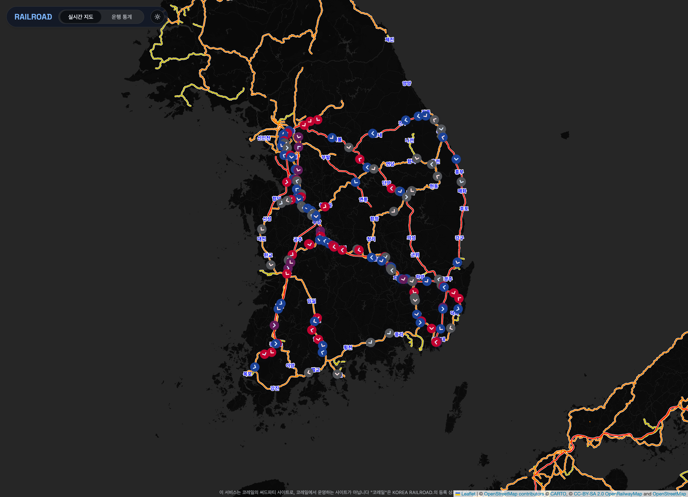

# RAILROAD

> https://train.lth.so

`RAILROAD`는 실시간 코레일 열차 지도입니다. 실시간 열차 위치와 열차별 상세 스케줄을 한 화면에서 제공합니다.



## 주요 기능

- 인터랙티브 철도 지도 위에 실시간 열차 위치 표시
- URL과 연동되는 열차 선택 및 특정 열차 따라가기
- 현재역, 다음역, 지연 시간, 스케줄을 포함한 열차 상세 정보 표시
- 동일 위치 polling을 보정한 열차 추정 속도 표시
- SSE 기반 실시간 열차 업데이트 스트리밍

## 모노레포 구조

- `apps/frontend`: 실시간 지도를 제공하는 React + Vite 클라이언트
- `apps/backend`: 열차 이벤트, 스케줄, 역 데이터를 제공하는 NestJS API

## 모노레포 명령어

```bash
pnpm install

# 두 앱 함께 실행
pnpm dev

# 앱별 실행
pnpm dev:frontend
pnpm dev:backend

# 빌드
pnpm build

# 린트
pnpm lint

# 테스트
pnpm test
```

## 프론트엔드

프론트엔드는 React 19 + Vite 기반이며, 주요 라우트는 다음과 같습니다.

- `/map`: 실시간 열차 지도와 열차 포커싱 화면

프론트 런타임 설정:

```bash
VITE_API_BASE_URL=http://localhost:3000
```

`VITE_API_BASE_URL`이 없으면 프론트는 상대 경로 `/api/...` 요청을 사용합니다.

## 백엔드

백엔드는 NestJS를 기반으로 열차와 역 API를 제공합니다.

### 주요 API 엔드포인트

- `GET /train`
- `GET /train/:id/schedule?date=YYYY-MM-DD`
- `GET /train/events` (SSE)
- `GET /station`

### Public API v1

외부 클라이언트를 위한 안정된 읽기 전용 계약은 `/api/v1`에서 제공합니다.

- `GET /api/v1/trains`
- `GET /api/v1/trains/:trainNo/schedule?serviceDate=YYYY-MM-DD`
- `GET /api/v1/trains/events` (SSE)
- `GET /api/v1/stations`

응답 계약과 사용 규칙은 [Public API 문서](./docs/public-api.md)를 참고하세요. 로컬 백엔드의 Swagger UI는 `http://localhost:3000/docs`, OpenAPI JSON은 `http://localhost:3000/openapi.json`에서 확인할 수 있습니다.

백엔드 런타임 설정:

```bash
PORT=3000
```

## 아키텍처

1. 백엔드가 실시간 코레일 열차 데이터를 수집하고 정규화합니다.
2. 최신 열차 snapshot과 위치 변경 이벤트를 프로세스 메모리에서 관리합니다.
3. 프론트엔드는 REST API와 SSE를 사용해 실시간 지도를 렌더링합니다.

프로세스가 재시작되면 메모리 snapshot은 초기화되며 첫 polling이 완료되면 자동으로 복구됩니다. 과거 열차 이벤트는 영구 저장하지 않습니다.

## 참고

- 이 프로젝트는 코레일이 직접 운영하는 서비스가 아닌 서드파티 서비스입니다.
- `"코레일"`은 KOREA RAILROAD.의 등록 상표입니다.

## 라이선스

MIT
